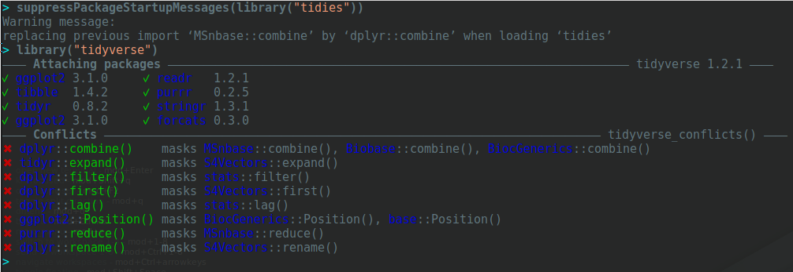

```{r env, echo=FALSE, message=FALSE, warning=FALSE}
suppressPackageStartupMessages(library("tidies"))
suppressPackageStartupMessages(library("BiocStyle"))
suppressPackageStartupMessages(library("MSnbase"))
```

# Introduction

The `tidies` package (from to contraction of *tidy* `eSet`) implements
tidy principles as defined in
the [tidyverse](https://www.tidyverse.org/) packages to omics-type
data based on the `eSet` class, with (currently at least for now), an
emphasis on quantitative proteomics data.

## High throughput data and the `eSet` class

The motivation to store omics data in dedicated containers is to
coordinate the high throughput data (e.g., gene or protein
expression), the sample annotation (phenotype data) and the feature
annotation (feature data).

A typical omics data structure, as defined by
the
[`eSet`](https://bioconductor.org/packages/release/bioc/vignettes/Biobase/inst/doc/BiobaseDevelopment.pdf) class,
is represented below. It's main features are

- An assay data slot containing the quantitative omics data
  (expression data), stored as a `matrix` and accessible with `exprs`.
  Features defined along the rows and samples along the columns.

- A sample metadata slot containing sample co-variates, stored as an
  annotated `data.frame` and accessible with `pData`. This data frame
  is stored with rows representing samples and sample covariate along
  the columns, and its rows match the expression data columns exactly.

- A feature metadata slot containing feature co-variates, stored as an
  annotated `data.frame` and accessible with `fData`. This dataframe's
  rows match the expression data rows exactly.


The coordinated nature of the high throughput data guarantees that the
dimensions of the different slots will always match (i.e the columns
in the expression data and then rows in the sample metadata, as well
as the rows in the expression data and feature metadata) during data
manipulation. The metadata slots can grow additional co-variates
(columns) without affecting the other structures.


To illustrate such an omics data container, we'll make use of the
`msnset` object that comes with the `r Biocpkg("MSnbase")` package,
which contains data for `r nrow(msnset)` features and `r ncol(msnset)`
samples.


```{r msnset}
library("MSnbase")
data(msnset)

## Some test sample groups
msnset$group <- c("A", "A", "B", "B")
dim(msnset)
```

The expression data:

```{r exprs}
head(exprs(msnset))
```

The sample metadata:

```{r pData}
pData(msnset)
```

The feature metadata:

```{r fData}
fData(msnset)[1:10, 1:5]
## all feature variables
fvarLabels(msnset)
```
## Tidy tools

The [*tidy data*](https://www.jstatsoft.org/article/view/v059i10)
definition and [tidy tools
manifesto](http://tidyverse.tidyverse.org/articles/manifesto.html) lay
out the principles that packages in the tidyverse package. `tidies`
isn't part of the `tidyverse`, but aims at applying these same
principles. The concepts that are relevant for the application to
omics data are

- Reuse of existing data structures; in this case `eSet` objects, that
  constitute our *tidy* omics data.

- Compose simple functions with the pipe; here we apply the widely
  used `r CRANpkg("dplyr")` functions and `r CRANpkg("magrittr")`
  `%>%` operator. Each of the adapted tidy function to use and return
  tidy `eSet` data.

- Keep the ability to use existing Bioconductor functions that operate
  on the `eSet` class; this assumes that these functions are tidy
  themselves, i.e. that they return an `eSet` object.

## The `tidies` package

The goal of this package is to support the `dplyr` function such as
`select`, `filter`, `group_by`, `summarise`, ... direcly on omics data
containers described above. The function act on the respective
variable and expression slots and preserve the object's class.

Another approach is to convert the omics objects to tidy `tibbles` and
work direcly with these. This can easily be done with the Bioconductor
`r Biocpkg("biobroom")` package, that will convert the
`r nrow(msnset)` features by `r ncol(msnset)` samples into a
`r prod(dim(msnset))` tibble:

```{r biobroom}
library("biobroom")
tidy(msnset, addPheno = TRUE)
```

Using `biobroom::tidy` drops the feature data that, sometimes, is
important. It is possible to create dataframe that contains these
metadata using the following approach. First, combine the expression
data and the feature data into a single *wide* dataframe using `ms2df`

```{r ms2df}
x <- MSnbase::ms2df(msnset)
```

which then can be converted to a long, tidy, form with

```{r gather}
fv <- fvarLabels(msnset)
library("tidyr")
x <- tidyr::pivot_longer(x,
                         names_to = "sample",
                         values_to = "exprs",
                         -fv)
                        
x
```

to produce a dataframe with `r nrow(x)` rows corresponding to the
original `r nrow(msnset)` features for the `r ncol(exprs(msnset))`
samples, and, for each of these, the corresponding feature
metadata.

Given that this coercion is often useful, it is implemented in
`as_tibble` (see the example below).

# Using `tidies`

We start by loading the `tidies` package (which also automatically
loads and attaches `r CRANpkg("magrittr")` for the `%>%` operator).

```{r loadpackage}
library("tidies")
```

## Select feature or sample variables

Select sample variables (updates only the phenotypic data)

```{r selectsamples}
msnset %>%
    select(group) %>%
    pData
```

Note that the output of `select(group)` is an `MSnSet` - we pipe it
directly into `pData` to demonstrate that only that variable was
retained.

Select feature variables (updates only the feature data)

```{r selectfeats}
## All feature variables
fvarLabels(msnset)

## Select a single feature variable
msnset %>%
    select(charge) %>%
    fvarLabels

## Select features using a pattern
msnset %>%
    select(starts_with("Protein")) %>%
    fvarLabels
```

Select sample and feature variables

```{r selectboth}
msnset %>%
    select(group) %>%
    select(starts_with("Prot"))
```

## Order data by it feature of sample variables

Arrange columns/samples

```{r arrangesamples}
msnset %>%
    arrange(desc(group)) %>%
    pData
```

Arrange rows/features and select feature variables

```{r arrangefeats}
msnset %>%
    arrange(charge) %>%
    select(charge) %>%
    fData %>%
    head
```

## Return features and samples with matching conditions

Filter using feature variables

```{r filterfeats}
msnset %>%
    filter(ProteinAccession == "ENO") %>%
    exprs
```

Filter using phenotypic (samples) variables

```{r filtersamples}
msnset %>%
    filter(group == "A") %>%
    exprs %>%
    head

```

Filter on both feature and sample variables

```{r filterboth}
msnset %>%
    filter(group == "A") %>%
    filter(ProteinAccession == "ENO") %>%
    exprs
```

## Group by one or more feature or sample variables

Group by features

```{r groupby1}
msnset %>%
    group_by(ProteinAccession) %>%
    show
```

Group by samples

```{r groupby2}
msnset %>%
    group_by(group) %>%
    show
```

Group by features and samples

```{r groupby3}
msnset %>%
    group_by(ProteinAccession) %>%
    group_by(group) %>%
    show
```

## Summarise the expression values of a dataset

Grouping and summarising by features

```{r summarise1}
msnset %>%
    group_by(charge) %>%
    summarise(median(exprs, na.rm = TRUE)) %>%
    exprs

msnset %>% group_by(ProteinAccession) %>%
    summarise(median(exprs, na.rm = TRUE)) %>%
    exprs %>%
    head
```

Grouping and summarising by samples

```{r summarise2}
msnset %>% group_by(group) %>%
    summarise(mean(exprs, na.rm = TRUE)) %>%
    exprs %>%
    head
```

Grouping by features and samples

```{r summarise3}
msnset %>%
    group_by(charge) %>%
    summarise(mean(exprs)) %>%
    group_by(group) %>%
    summarise(max(exprs, na.rm = TRUE)) %>%
    exprs
```

In the following example, we show how `dplyr` and `MSnbase` (here we
using `filterNA`, `combineFeatures` and `normalise`) functions oberate
seamlessly and can be mixed and matched with in chain of operations:


```{r summarise4}
msnset %>%
    filterNA() %>%
    combineFeatures(method = "median", fcol = "ProteinAccession") %>%
    group_by(group) %>%
    summarise(mean(exprs)) %>%
    normalise(method = "quantiles") %>%
    filter(ProteinAccession %in% c('ENO', 'BSA')) %>%
    exprs
```

In this last example, we use `as_tibble` and pipe the mutated data
directly into `ggplot2`:

```{r ggplot}
library("ggplot2")
msnset %>% as_tibble %>%
    mutate(rt = cut(retention.time, 7)) %>%
    ggplot(aes(x = sample, y = exprs)) +
    geom_boxplot() + facet_grid(charge ~ rt)
```

# Future work

See issues, and the [TODO](https://github.com/lgatto/tidies/issues/1)
issue in particular for current and future work. Depending on
interest, the functionality presented here could be extended to other
data types such as `SummarizedExperiments`.

A technical issue is with the dependency on both Bioconductor and the
tidyverse is the recurrent name clashes:



The `combine` function, for example, is defined as a generic with
signature `combine(x, y, ...)` in `r Biocpkg("BiocGenerics")`, while
it is `combine(...)` in `r CRANpkg("dplyr")`.
